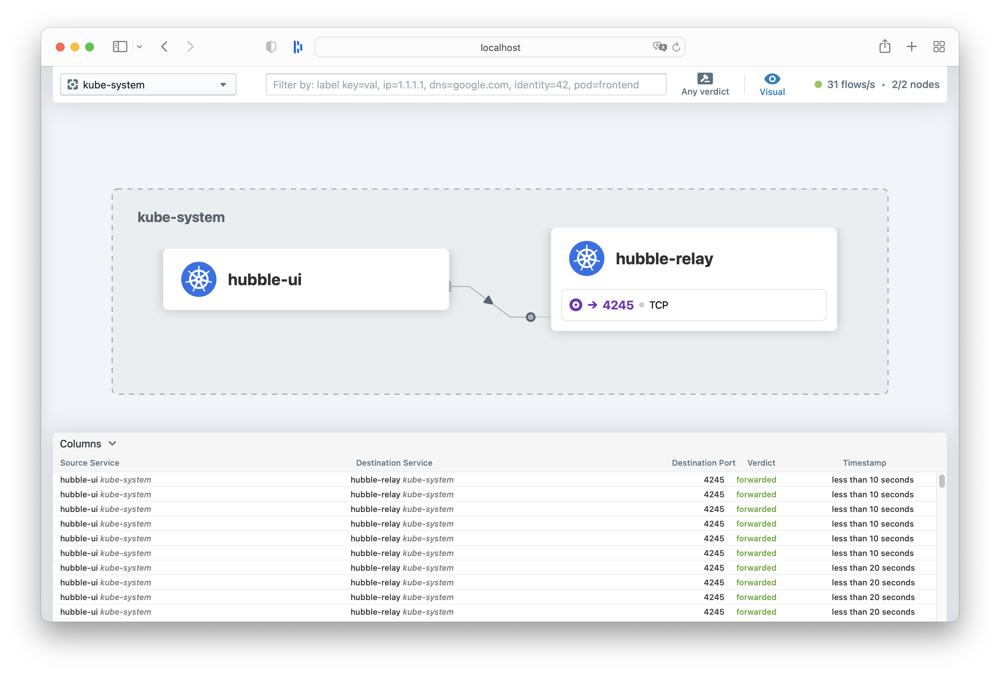
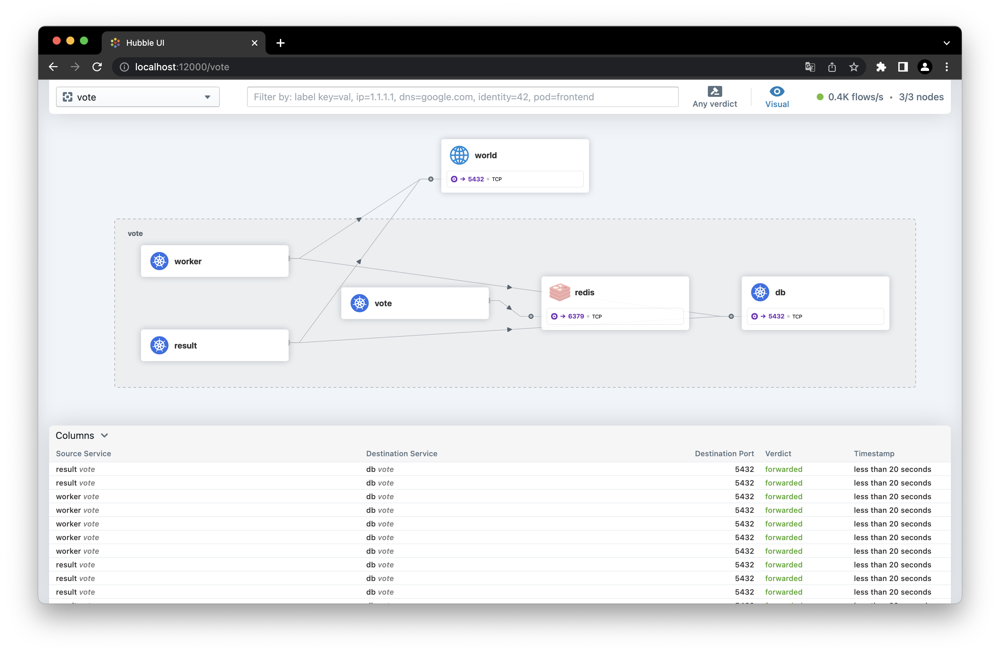

# Cilium Kubernetes CNI

A lab to test the [Cilium Kubernetes CNI](https://docs.cilium.io/en/stable/) and its observability capabilities.

## Requirements

### Create VMs

Create instances for the cluster with [Multipass](https://multipass.run/docs):

```bash
multipass launch --name server --mem 2G --cpus 2
multipass launch --name worker --mem 4G --cpus 2

$ multipass list
Name                    State             IPv4             Image
server                  Running           192.168.205.8    Ubuntu 20.04 LTS
worker                  Running           192.168.205.9    Ubuntu 20.04 LTS
```

### Kubernetes cluster

For this lab I will use [K3s](https://rancher.com/docs/k3s/latest/en/) to install the Kubernetes cluster. 

As I want to test the [Cilium CNI](https://docs.cilium.io/en/stable/), I will disable the installation of [Flannel](https://github.com/flannel-io/flannel), which is the default CNI provided with K3s.

#### Install the server node

Connect on the host with SSH:

```bash
multipass shell server
export K3S_TOKEN="my_secret_token"
export INSTALL_K3S_EXEC="--flannel-backend=none --disable-network-policy --disable=traefik"
curl -sfL https://get.k3s.io | sh -
```

#### Install the worker node

```bash
multipass shell worker
export K3S_URL=https://192.168.205.8:6443
export K3S_TOKEN="my_secret_token"
curl -sfL https://get.k3s.io | sh -
```

```bash
$ sudo k3s kubectl get nodes
NAME     STATUS     ROLES                  AGE    VERSION
server   NotReady   control-plane,master   101s   v1.23.6+k3s1
worker   NotReady   <none>                 51s    v1.23.6+k3s1
```

#### Access

Get the configuration file from the server node to you local workstation.

```bash
# On the server node
sudo cat /etc/rancher/k3s/k3s.yml
```

Point the `KUBECONFIG`environment variable to your file. You may also have to replace the IP in the file. In my case it was `127.0.0.1` and I have replaced it by the IP of the server node `192.168.205.8`.

Check it works with kubectl from your workstation:

```bash 
$ kubectl get nodes
NAME     STATUS     ROLES                  AGE     VERSION
server   NotReady   control-plane,master   7m45s   v1.23.6+k3s1
worker   NotReady   <none>                 6m55s   v1.23.6+k3s1
```

## Cilium

### Install Cilium CLI

Install the Cilium CLI on your workstation.

[Documentation for Cilium CLI installation](https://docs.cilium.io/en/stable/gettingstarted/k8s-install-default/#install-the-cilium-cli)

```bash
# For MacOS
curl -L --remote-name-all https://github.com/cilium/cilium-cli/releases/latest/download/cilium-darwin-amd64.tar.gz{,.sha256sum}
shasum -a 256 -c cilium-darwin-amd64.tar.gz.sha256sum
sudo tar xzvfC cilium-darwin-amd64.tar.gz /usr/local/bin
rm cilium-darwin-amd64.tar.gz{,.sha256sum}
```

### Install Cilium

Check first that you have exported the KUBECONFIG and that you can access the K3s cluster with kubectl from your workstation. 

```bash
$ cilium install 
ℹ️  using Cilium version "v1.10.11"
🔮 Auto-detected cluster name: default
🔮 Auto-detected IPAM mode: cluster-pool
🔑 Created CA in secret cilium-ca
🔑 Generating certificates for Hubble...
🚀 Creating Service accounts...
🚀 Creating Cluster roles...
🚀 Creating ConfigMap for Cilium version 1.10.11...
🚀 Creating Agent DaemonSet...
🚀 Creating Operator Deployment...
⌛ Waiting for Cilium to be installed and ready...
♻️  Restarting unmanaged pods...
♻️  Restarted unmanaged pod kube-system/local-path-provisioner-6c79684f77-zcrnm
♻️  Restarted unmanaged pod kube-system/metrics-server-7cd5fcb6b7-bv6lb
♻️  Restarted unmanaged pod kube-system/coredns-d76bd69b-wv28b
✅ Cilium was successfully installed! Run 'cilium status' to view installation health
```

### Status

You can easily check the status of all the Cilium components:

```bash 
$ cilium status
    /¯¯\
 /¯¯\__/¯¯\    Cilium:         OK
 \__/¯¯\__/    Operator:       OK
 /¯¯\__/¯¯\    Hubble:         disabled
 \__/¯¯\__/    ClusterMesh:    disabled
    \__/

DaemonSet         cilium             Desired: 2, Ready: 2/2, Available: 2/2
Deployment        cilium-operator    Desired: 1, Ready: 1/1, Available: 1/1
Containers:       cilium             Running: 2
                  cilium-operator    Running: 1
Cluster Pods:     3/3 managed by Cilium
Image versions    cilium             quay.io/cilium/cilium:v1.10.11@sha256:48e1a261046c2e534e370f960f0920233f9fd5ad4623aebdca0e403264a06202: 2
                  cilium-operator    quay.io/cilium/operator-generic:v1.10.11@sha256:468ce59342298f1cf87ca8512cd9192754e83348b347a4bc7c27158ef9c4a37d: 1
```

### Network connectivity

Cilium CLI provides also the ability to validate the connectivity by making all the needed test.

```bash 
$ cilium connectivity test
[...]

🏃 Running tests...

[=] Test [no-policies]
................................
[=] Test [allow-all-except-world]
..............
[=] Test [client-ingress]
..
[=] Test [echo-ingress]
....
[=] Test [client-egress]
....
[=] Test [to-entities-world]
......
[=] Test [to-cidr-1111]
....
[=] Test [echo-ingress-l7]
....
[=] Test [client-egress-l7]
..........
[=] Test [dns-only]
..........
[=] Test [to-fqdns]
......
✅ All 11 tests (96 actions) successful, 0 tests skipped, 0 scenarios skipped.
```

## Hubble

[The Hubble documentation](https://docs.cilium.io/en/stable/gettingstarted/hubble_setup/#setting-up-hubble-observability)

### Enable Hubble 

You can easily ebable Hubble observability with the Cilium CLI.

```bash
$ cilium hubble enable
🔑 Found CA in secret cilium-ca
✨ Patching ConfigMap cilium-config to enable Hubble...
♻️  Restarted Cilium pods
⌛ Waiting for Cilium to become ready before deploying other Hubble component(s)...
🔑 Generating certificates for Relay...
✨ Deploying Relay from quay.io/cilium/hubble-relay:v1.10.11...
⌛ Waiting for Hubble to be installed...
✅ Hubble was successfully enabled!
```

You can check the state of each Cilium component including Hubble with `cilium status`.

At this step, here the resource consumption in the cluster:

```bash 
$ kubectl top node
NAME     CPU(cores)   CPU%   MEMORY(bytes)   MEMORY%   
server   113m         5%     1102Mi          55%       
worker   40m          2%     742Mi           18%  
```

### Hubble UI

Enable the Hubble UI with the Cilium CLI:

```bash
$ cilium hubble enable --ui
🔑 Found CA in secret cilium-ca
✨ Patching ConfigMap cilium-config to enable Hubble...
♻️  Restarted Cilium pods
⌛ Waiting for Cilium to become ready before deploying other Hubble component(s)...
✅ Relay is already deployed
✨ Deploying Hubble UI from quay.io/cilium/hubble-ui:v0.8.5 and Hubble UI Backend from quay.io/cilium/hubble-ui-backend:v0.8.5...
⌛ Waiting for Hubble to be installed...
✅ Hubble was successfully enabled!
```

Then consult the UI with the command `cilium hubble ui` that rely on port-forward:



Let's deploy a demo app to see more flows! 

I chose to use the [voting-app](https://github.com/dockersamples/example-voting-app) from Docker.


